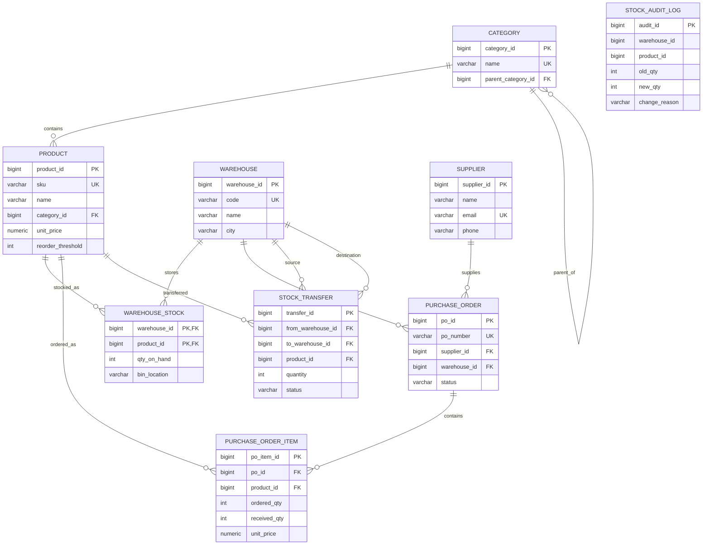

# StockVault SQL - Verified Entity Relationship Diagram

```mermaid
erDiagram
    CATEGORY ||--o{ PRODUCT : contains
    CATEGORY ||--o{ CATEGORY : parent_of
    PRODUCT ||--o{ WAREHOUSE_STOCK : stocked_as
    WAREHOUSE ||--o{ WAREHOUSE_STOCK : stores
    SUPPLIER ||--o{ PURCHASE_ORDER : supplies
    WAREHOUSE ||--o{ PURCHASE_ORDER : receives
    PURCHASE_ORDER ||--o{ PURCHASE_ORDER_ITEM : contains
    PRODUCT ||--o{ PURCHASE_ORDER_ITEM : ordered_as
    PRODUCT ||--o{ STOCK_TRANSFER : transferred
    WAREHOUSE ||--o{ STOCK_TRANSFER : source
    WAREHOUSE ||--o{ STOCK_TRANSFER : destination
    CATEGORY {
        bigint category_id PK
        varchar name UK
        bigint parent_category_id FK
    }
    SUPPLIER {
        bigint supplier_id PK
        varchar name
        varchar email UK
        varchar phone
    }
    WAREHOUSE {
        bigint warehouse_id PK
        varchar code UK
        varchar name
        varchar city
    }
    PRODUCT {
        bigint product_id PK
        varchar sku UK
        varchar name
        bigint category_id FK
        numeric unit_price
        int reorder_threshold
    }
    WAREHOUSE_STOCK {
        bigint warehouse_id PK, FK
        bigint product_id PK, FK
        int qty_on_hand
        varchar bin_location
    }
    PURCHASE_ORDER {
        bigint po_id PK
        varchar po_number UK
        bigint supplier_id FK
        bigint warehouse_id FK
        varchar status
    }
    PURCHASE_ORDER_ITEM {
        bigint po_item_id PK
        bigint po_id FK
        bigint product_id FK
        int ordered_qty
        int received_qty
        numeric unit_price
    }
    STOCK_TRANSFER {
        bigint transfer_id PK
        bigint from_warehouse_id FK
        bigint to_warehouse_id FK
        bigint product_id FK
        int quantity
        varchar status
    }
    STOCK_AUDIT_LOG {
        bigint audit_id PK
        bigint warehouse_id
        bigint product_id
        int old_qty
        int new_qty
        varchar change_reason
    }
```
